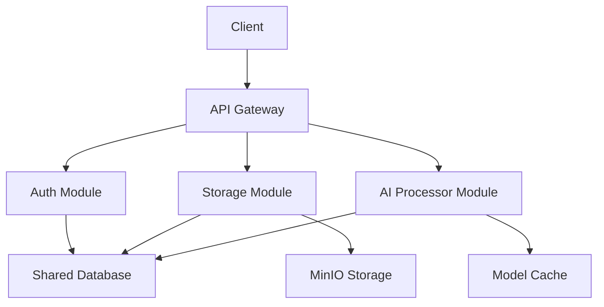

# AI Cloud Storage Architecture Overview

## Modular Monolith Architecture

The AI Cloud Storage system is designed as a modular monolith, combining the benefits of microservices (modularity, separation of concerns) with the simplicity of monolithic deployment. This architecture provides a balance between development velocity and operational simplicity.

### Core Principles

1. **Modularity**: Each major function is encapsulated in its own module
2. **Loose Coupling**: Modules communicate through well-defined interfaces
3. **High Cohesion**: Related functionality is grouped together
4. **Independent Scalability**: Modules can be scaled independently
5. **Shared Infrastructure**: Common resources are efficiently shared

## System Components

### 1. Core Infrastructure

The core infrastructure provides common functionality used across all modules:

- Configuration Management
- Database Connections
- Caching
- Logging
- Monitoring
- Security

### 2. Auth Module

Handles all authentication and authorization:

- User Management
- JWT Token Generation/Validation
- Role-Based Access Control
- Session Management
- Security Policies

### 3. Storage Module

Manages file storage and retrieval:

- File Upload/Download
- Metadata Management
- Versioning
- Access Control
- MinIO Integration
- Caching Strategy

### 4. AI Processor Module

Provides AI/ML capabilities:

- Text Analysis
- Content Classification
- Semantic Search
- Metadata Extraction
- Model Management
- Batch Processing

## Module Communication



## Data Flow

1. **Authentication Flow**:
   - Client sends credentials
   - Auth module validates and issues JWT
   - Token used for subsequent requests

2. **Storage Flow**:
   - Client uploads file
   - Storage module handles storage
   - AI processor analyzes content
   - Metadata stored in database

3. **Retrieval Flow**:
   - Client requests file
   - Auth module validates access
   - Storage module serves content
   - Cache improves performance

## Technical Implementation

### Technology Stack

- **Framework**: FastAPI
- **Database**: PostgreSQL (Async)
- **Cache**: Redis
- **Storage**: MinIO
- **AI/ML**: Hugging Face Transformers
- **Authentication**: JWT

### Module Structure

Each module follows a consistent structure:

```
module/
├── __init__.py      # Module initialization
├── routes.py        # API endpoints
├── models.py        # Data models
├── service.py       # Business logic
├── dependencies.py  # Dependencies
└── api/            # API implementations
```

### Configuration Management

- Environment-based configuration
- Module-specific settings
- Feature flags for modules
- Secure secrets management

## Deployment

### Development Environment

```yaml
services:
  app:
    build:
      target: development
    volumes:
      - .:/app
    environment:
      - DEBUG=true
```

### Production Environment

```yaml
services:
  app:
    build:
      target: production
    deploy:
      replicas: 2
    environment:
      - DEBUG=false
```

## Monitoring and Logging

- Prometheus metrics
- OpenTelemetry tracing
- Structured logging
- Health checks
- Performance monitoring

## Security Considerations

1. **Authentication**:
   - JWT with refresh tokens
   - Role-based access
   - Rate limiting

2. **Data Security**:
   - Encryption at rest
   - Secure communication
   - Access auditing

3. **Infrastructure**:
   - Network isolation
   - Regular updates
   - Security scanning

## Future Considerations

1. **Scalability**:
   - Module-specific scaling
   - Cache optimization
   - Load balancing

2. **Reliability**:
   - Circuit breakers
   - Retry mechanisms
   - Fallback strategies

3. **Extensibility**:
   - Plugin system
   - API versioning
   - Module hot-reloading
